# Cloud Computing Course Content

This repository contains content organized for a cloud computing course. It includes resources in markdown, XMind, and SVG formats, covering various aspects of cloud technologies, data centers, and streaming platforms.

## Key Topics

### Cloud Applications
- **Core Components**: Overview of HDFS, YARN, and data storage technologies like Ceph.
- **Data Processing**: Frameworks like MapReduce, Tez, Spark, Pig, and LLAP.
- **Data Storage and Management**: Technologies such as HBase, Hive, Impala, and Druid.

### Data Centers and Networking
- **Data Center Topologies**: Concepts like TCP incast, bisection width, and Clos network.
- **Congestion Control**: Handling congestion in data centers using multi-path routing and real-time considerations.

### Cloud Technologies
- **OpenStack**: Core services like Nova, Glance, and Cinder for cloud management.
- **Other Platforms**: Eucalyptus, OpenNebula, CloudStack, JupyterHub, and RedHat OpenShift.

### Data Streaming
- **Frameworks**: A deep dive into Spark Streaming and Storm, focusing on stream processing and distributed systems.

## Visual Overview

## License

This repository is licensed under the MIT License. See the [LICENSE](./LICENSE) file for details.
